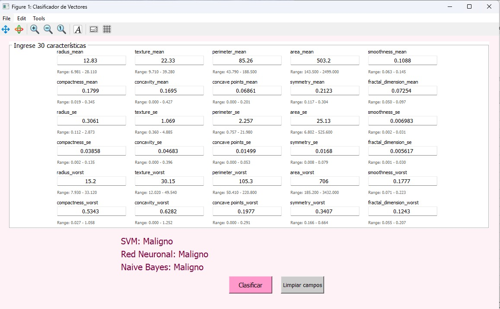

# 📊 Breast Cancer Tumor Classification Using Machine Learning

This repository contains the implementation and evaluation of three machine learning algorithms—**Naive Bayes**, **Support Vector Machines (SVM)**, and **Artificial Neural Networks (ANN)**—to classify breast tumors as **benign** or **malignant** using features from the [Wisconsin Diagnostic Breast Cancer (WDBC)](https://archive.ics.uci.edu/ml/datasets/Breast+Cancer+Wisconsin+(Diagnostic)) dataset.

The models were developed in **Octave**, with custom implementations focusing on statistical robustness and performance. Data preprocessing included normalization and class-balanced splits for training and testing. Evaluation was based on standard classification metrics: **accuracy**, **precision**, **recall**, and **F1-score**.

## 🧠 Objective

This study aims to compare the predictive performance of Naive Bayes, SVM, and Neural Networks in classifying breast tumors. Using 30 features derived from cell nuclei images, each model was trained and tested on a well-established medical dataset. The ultimate goal is to identify the most effective algorithm to support early and accurate diagnosis of breast cancer.

### 🔍 Summary of Results
- **Neural Network (ANN)**: Highest accuracy at **98.83%**, with exceptional ability to distinguish between tumor types.
- **Support Vector Machine (SVM)**: Accuracy of **93.57%** using a custom maximum-margin approach.
- **Naive Bayes**: Accuracy of **89.55%**, with the benefit of high computational efficiency.

For full methodological details and results, please refer to the included investigation report.

---

## 📁 Repository Contents

| File | Description |
|------|-------------|
| `BCClassification.m` | Graphical interface where users can input tumor characteristics to classify using all three models. |
| `nb_model.mat` | Pre-trained Naive Bayes model used by the interface. |
| `rn_model.mat` | Pre-trained Neural Network model used by the interface. |
| `svm_model.mat` | Pre-trained SVM model used by the interface. |
| `WDBC_dataset.csv` | Raw dataset from the WDBC (Wisconsin Diagnostic Breast Cancer) database. |
| `BYBC.m` | Code used to train the Naive Bayes classifier. |
| `RNBC.m` | Code used to train the Artificial Neural Network. |
| `SVM.m` | Code used to train the Support Vector Machine classifier. |
| `SVMTBC1.xlsx` | Training set (70% of the dataset) used for fitting all models. |
| `SVMPBC0.xlsx` | Testing set (30%, benign cases). |
| `SVMPBC1.xlsx` | Testing set (30%, malignant cases). |
| `report.pdf` | Full investigation report describing methodology, experiments, and analysis. |

---

## 🖼️ Interface Preview
> 

##💻 Requirements
GNU Octave (recommended version ≥ 7.0)

The .mat model files (nb_model.mat, rn_model.mat, svm_model.mat) must be in the same folder as BCClassification.m to ensure correct execution.

No additional packages required beyond base Octave functionality.

##🚀 How to Use
Open Octave and navigate to the project folder.

Run BCClassification.m to launch the user interface.

Input the tumor characteristics manually in the provided fields.

Submit the input to receive predictions from all three algorithms.

##📖 Report
For more detailed information on the dataset, preprocessing methods, model training, and evaluation metrics, refer to the full investigation report: report.pdf.

##📬 Contact
For questions, academic inquiries, or contributions, feel free to open an issue or contact the author(s).

